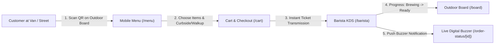

# ☕ BREW — Luxury Mobile Coffee Van & Outlet on Wheels

[](https://nextjs.org/)
[](https://react.dev/)
[](https://www.typescriptlang.org/)
[](https://tailwindcss.com/)
[](https://firebase.google.com/)
[]()

> **BREW** is a luxury artisanal coffee outlet on wheels. Designed for modern mobile coffee vans and trucks, it connects street-side customers, outdoor digital queue boards, mobile kitchen baristas, and an autonomous fleet operations AI engine into a seamless ecosystem.

---

## 🌟 Architecture & Workflow



1. **Outdoor Digital Display Board (`/board`)**: Mounted on the exterior of the van with high contrast daylight styling, live tokens for "Now Serving" vs "Brewing Now", wait times, and a canvas-based scannable QR code.
2. **Barista Kitchen Display System (`/barista`)**: The touch KDS inside the van featuring incoming audio chimes, 1-tap ticket progression, curbside vehicle runner notes, and an instant 86/sold-out inventory toggle drawer.
3. **Customer Live Digital Buzzer (`/order-status/[id]`)**: Replaces vibrating restaurant pagers with a progressive web app digital buzzer featuring live circular progress rings, haptic vibration, and audio alerts.
4. **Curbside & Window Checkout (`/cart`)**: Allows guests parked nearby in cars to specify vehicle details for runner delivery.
5. **Van Station & Schedule Tracker (`/location`)**: Shows today's GPS spot, hours, directions, vehicle equipment specs, and weekly itinerary.

---

## 🤖 Autonomous Operations Multi-Agent Engine

BREW integrates 6 specialized autonomous operations AI agents powered by `src/lib/smartAgentsEngine.ts`:

1. **🛡️ Inventory Sentinel**: Live auto-deduction of coffee beans (kg), milk (L), paper cups, and bakery pastries with every order. Analyzes burn rates and generates predictive stockout alerts with 1-click van restocking.
2. **🚗 Curbside Drive-Thru Expediter**: Interactive customer check-in (*"I'm 2 mins away" / "I'm at the curb"*) that syncs espresso shot extraction timing with car arrival for sub-60s window handovers.
3. **⚡ Yield Optimizer (Flash Deals)**: Late afternoon perishable waste prevention flash bundles (e.g., 25% off Cappuccino + Cinnamon Roll) toggled from the KDS with a live customer banner on `/` and `/menu`.
4. **🎪 Event Booking Concierge**: Automated instant 3-tier catering quotations (*Classic Brew, Artisanal Signature, VIP Unlimited Bar*) with ingredient allocations for corporate & campus bookings.
5. **📢 Hyper-Local Hype Broadcaster**: Auto-generates localized social copy (WhatsApp Status, Instagram Story, SMS) tailored to today's active parking spot and weather conditions.
6. **❤️ Guest Sentiment Guardian**: Detects customer reviews with rating ≤ 3 stars, creates a personalized Head Barista apology, and auto-issues a ₹50 recovery credit voucher (`BREWCARExxxx`) redeemable in the cart.

---

## 🚀 Quick Start

### 1. Prerequisites
- Node.js `v20.x` or higher
- npm / pnpm / yarn

### 2. Installation
```bash
git clone https://github.com/your-org/brew.git
cd brew
npm install
```

### 3. Environment Setup
Copy the example environment file:
```bash
cp .env.example .env.local
```
Fill in your Firebase credentials in `.env.local` (or leave empty to use the built-in demo auth mode).

### 4. Run Development Server
```bash
npm run dev
```
Open [http://localhost:3000](http://localhost:3000) in your browser.

---

## 🛠️ Production Build & Verification

```bash
# 1. Type check
npx tsc --noEmit

# 2. Linting check (0 errors, 0 warnings)
npm run lint

# 3. Production build
npm run build

# 4. Start production server
npm start
```

---

## 📱 Routes & Features

| Route | Name | Target Device / User |
| :--- | :--- | :--- |
| `/` | **Home & 3D Brand Showcase** | Public / Desktop & Mobile |
| `/menu` | **Artisanal Handcrafted Menu** | Public / Smartphone |
| `/location` | **Where Is Our Van Today?** | Public / Smartphone |
| `/cart` | **Dedicated Cart & Curbside Checkout** | Public / Smartphone |
| `/order-status/[id]` | **Customer Live Digital Buzzer** | Public / Smartphone |
| `/board` | **Outdoor Digital Display Board** | Van Exterior Screen / Kiosk |
| `/barista` | **Barista Kitchen Display System** | Van Interior Tablet |
| `/sitemap.xml` | **Dynamic XML Sitemap** | Search Engine Crawlers |
| `/robots.txt` | **Crawler Directives** | Search Engine Crawlers |
| `/manifest.webmanifest` | **PWA Web App Manifest** | Mobile / Tablet PWA Install |

---

## 🔒 Security & Headers

The application includes hardened production security headers configured in `next.config.ts`:
- `X-Content-Type-Options: nosniff`
- `X-Frame-Options: SAMEORIGIN`
- `Referrer-Policy: strict-origin-when-cross-origin`
- `Permissions-Policy: camera=(), microphone=(), geolocation=(self)`

---

## 🚢 Deployment

### Deploy on Vercel
1. Push your repository to GitHub / GitLab / Bitbucket.
2. Import your repository into [Vercel](https://vercel.com).
3. Set your environment variables from `.env.example`.
4. Deploy! Next.js will automatically detect build configurations and prerender static pages.

### Deploy with Docker
```dockerfile
FROM node:20-alpine AS builder
WORKDIR /app
COPY package*.json ./
RUN npm ci
COPY . .
RUN npm run build

FROM node:20-alpine AS runner
WORKDIR /app
ENV NODE_ENV=production
COPY --from=builder /app/package*.json ./
COPY --from=builder /app/.next ./.next
COPY --from=builder /app/public ./public
COPY --from=builder /app/node_modules ./node_modules
EXPOSE 3000
CMD ["npm", "start"]
```

---

## 📄 License
MIT © BREW Coffee Co.
